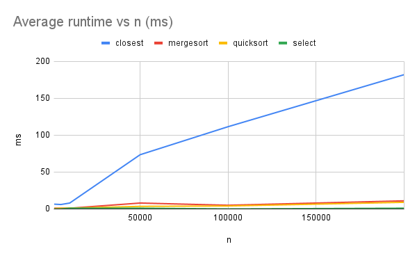
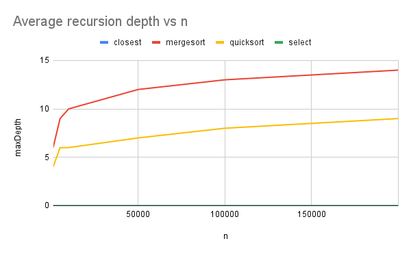

# DAA — Assignment 1

Design & Analysis of Algorithms — Assignment 1 (Java, Maven, JUnit 5).

This project implements four classic algorithms with **safe recursion patterns**, gathers **metrics** (time, recursion depth, comparisons, allocations), validates with tests, and reports results with **clean Git history**.

- CI: GitHub Actions runs `mvn test` on push/PR (JDK 17).
- Plots are stored in `docs/plots/`.

---

## Algorithms implemented

1. **MergeSort** (Divide & Conquer, Master Theorem Case 2)
   - Linear merge
   - Reusable buffer (single temp array)
   - Small-N cutoff via insertion sort

2. **QuickSort (robust)**
   - Randomized pivot
   - Recurse on the **smaller** partition; **iterate** over the larger one (bounded stack, ~O(log n) typical)

3. **Deterministic Select (Median-of-Medians, MoM5, O(n))**
   - Groups of 5, median-of-medians as pivot
   - In-place partition
   - Recurse only into the needed side (prefer the smaller side)

4. **Closest Pair of Points (2D, O(n log n))**
   - Presort by `x`
   - Recursive split; “strip” check scanned in **y**-order with ≤7–8 neighbor candidates

---

## Architecture & Metrics

- `org.example.util.Metrics` tracks:
  - `ms` — wall-clock time from `System.nanoTime()` (converted to ms)
  - `maxDepth` — maximum recursion depth seen
  - `comparisons` — coarse counter for comparisons
  - `allocs` — coarse counter for array allocations / temp buffers (MergeSort reuses a single buffer)
- **Depth control**:
  - QuickSort: recurse into the **smaller** side, loop on the larger one → call stack stays O(log n) typically.
  - Select (MoM5): recurse only into the side that contains k (and prefer the smaller side) → depth is bounded and linear time holds.
  - MergeSort: strict balanced split → depth ≈ ⌊log₂ n⌋.
- **Allocation control**:
  - MergeSort uses one reusable buffer passed down the recursion.
  - Partitioning is in-place for QS/Select to avoid extra arrays.
- Tests validate correctness and bounds (QS depth; Select vs `Arrays.sort`).

**Folders**
```text
src/
  main/java/org/example/
    algos/    # MergeSort, QuickSort, Select, ClosestPair
    bench/    # Runner that emits CSV (simple harness)
    util/     # Metrics, Csv helper, etc.
  test/java/org/example/algos/
    MergeSortTest, QuickSortTest, SelectTest, ClosestPairTest
docs/
  plots/      # time_vs_n.png, depth_vs_n.png
```

Recurrence analysis (short, per algorithm)
MergeSort. Recurrence T(n) = 2T(n/2) + Θ(n) (merge is linear). By Master Theorem (Case 2), T(n) = Θ(n log n).
Depth is Θ(log n). The small-N insertion-sort cutoff improves constants for tiny inputs.
QuickSort (randomized). Expected comparisons are Θ(n log n) under random pivoting.
With “recurse smaller / iterate larger”, the recursion depth is typically O(log n) even on skewed partitions; in-place partitioning keeps allocations minimal.
Select (MoM5). With groups of 5 and median-of-medians pivot, recurrence
T(n) = T(⌈n/5⌉) + T(7n/10 + O(1)) + O(n) gives T(n) = Θ(n).
We recurse only into the side that contains the target rank (prefer smaller side) → bounded depth.
Closest Pair (2D). Presort by x, divide, conquer, and check a vertical strip in y-order; each point checks ≤7–8 neighbors.
Recurrence T(n) = 2T(n/2) + O(n) yields O(n log n).

How to run
Prereqs: JDK 17, Maven 3.9+
# run tests
mvn clean test
Bench / CSV (simple harness):
Run org.example.bench.Runner from IDE to print CSV (optionally write results.csv via the Csv helper).
Import the CSV into Google Sheets:
File → Import → Upload results.csv → Insert new sheet.
Data → Pivot table:
Rows: n (ascending)
Columns: algo
Values: AVERAGE of ms (for runtime), then AVERAGE of maxDepth (for depth).
Insert → Chart → Line chart.
Export charts as PNG and place them in docs/plots/.

Measurements & Plots


We measured n ∈ {5k, 10k, 50k, 100k, 200k} across multiple seeds and averaged.
Average runtime vs n (ms)
Average recursion depth vs n
Constant-factor discussion
Closest pair shows higher constant factors (presort + geometric strip logic), so its line sits above sorting for the same n despite similar O(n log n) growth.
MergeSort benefits from a reusable buffer and the insertion-sort cutoff (better caches & fewer allocations on small subarrays).
QuickSort depth stays low due to “smaller-first recursion”; randomized pivot avoids worst-case inputs typical for fixed pivots.
Occasional noise is due to GC and JIT warm-up; a JMH harness would further stabilize timings.
Summary (theory vs measurements)
Growth trends match theory: MergeSort/QuickSort/ClosestPair ≈ n log n, Select ≈ linear.
Depth behaves as expected: MergeSort ≈ log n, QuickSort low (smaller-first), Select nearly flat.
Differences are mostly constant-factor effects (allocation, cache locality, strip scan cost).
CI (GitHub Actions)
On push/PR the workflow:
checks out the repo
sets up Temurin JDK 17
runs mvn -B -q test
Git workflow (history highlights)
Branches:
main, feature/mergesort, feature/quicksort, feature/select, feature/closest, feature/metrics
Key commits:
init: maven, junit5, ci, readme
feat(metrics): counters, depth tracker, CSV writer
feat(mergesort): baseline + reuse buffer + cutoff + tests
feat(quicksort): randomized pivot + smaller-first recursion + tests
feat(select): deterministic select (MoM5) + tests
feat(closest): divide & conquer implementation + tests
docs(report): plots & README


Reproducibility & Future work
Seeds are logged with results to rerun the same experiments.
Future: add JMH micro-benchmarks, more adversarial inputs, and finer allocation profiling.

